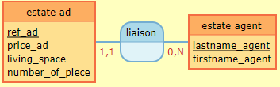

# Technical Test for 3G IMMO

## Explication

For this technical test, i need to build a CRUD for a property website.

It's a very hard challenge for me, because the constraint is to use Laravel, and **I never use a Framework of PHP**, just PHP Vanilla. So I have one week for learn and create this website.

This test need to have :  

- List of all estate ad with some information (reference, price, living space, number of piece, agent who have this ad)
- Creation of an estate ad
- Modification of an estate ad
- Deletion of an estate ad

I need to use :  

- Laravel 8 for back-end
- All I want for front-end

And, as a bonus, I can add a filter by price and/or living space.

So, let's do it !  

## Resources and tools I used :

- GitHub for storage online my code and versionning
- Gitmind for build a visual view of User Story, Route and Data Base
- [Laragon](https://laragon.org/), for a configuration of my environment to Laravel
- YouTube for learn Laravel with video _(I used [this playlist](https://www.youtube.com/playlist?list=PLeeuvNW2FHVj4vHJRj9UDeDsXshHlnHJk) from [Nord Coders](https://www.youtube.com/c/NordCoders))_
- The official documentation of [Laravel](https://laragon.org/docs/)
- The official documentation of [PHP](https://www.php.net/)
- [Mocodo](http://www.mocodo.net/) for have an "official" visual of my data base
- Code from my school [O'Clock](https://oclock.io/) I used

## The different stages of creation :
First, I receive the technical test the 23/08/2022, at, approximatly, 4pm.  
If I say that, it's because I will write here what I did every day.  
And second information : I was in training from 9 a.m. to 5 p.m. on weekdays, and with a part-time job _(21 hours a week)_ in the evenings _(usually from 6 p.m. to 11 p.m.)_ and weekends. So I did this project on my remaining time, as well as on a few hours of training _(I know, it's not good, but shh ;) )_. This information is just for say I don't work on this project 8 hours a day.  

So, let's go ! ;### 23/08/2022 : Start to get some videos and documentation of Laravel
I found [this playlist](https://www.youtube.com/playlist?list=PLeeuvNW2FHVj4vHJRj9UDeDsXshHlnHJk) and start to watch this, the 2 first episod.  
I install Laragon for pre-built my environment.  
I'm on Windows for know.  
I just test the system of view and route for print an "Hello World" first.  

### 24/08/2022 : Start to write data base

This day, I start to write with my word and with GitMind the data base, the route and the user story.  
For the data base, it was _easy_ because there are only two table, the estate ad and the estate agent.  
There are two relation :

- one-to-one from estate ad to estate agent
- zero-to-many from estate agent to estate ad

So, it gives that _(one in english for you, and one une french because the project is for the french job)_ :  

But I need to join the 2 tables with a foreign key, because just one agent is on the estate ad, but an agent can have a lot of estate ad. So I decide to contact my recruiter for have the approbation for create an over field on the table.

### 25/08/2022 : Continue the database and problems

So, this day, I had the answer of my recruiter : the fields he gave me are the necesary fields, and I can add more field, like ID, foreign key and over.  
So, I decide to add others fields, like ID for estate agent, and "ID_agent" for the estate ad.  
I know we can add more, like "create by/at", or "modify by/at", and over, but I focus on the main objectif, just the CRUD, without login or sign in, because I have no time for this now.  
But, I can add this in the roadmap for the application, and talk to this with the recruiter for proof I think about it.  
And if I have the time, I add some features, like more esthetic, or the other fielsd in the database ;)

But I have one little problem : I don't know how, but phpMyAdmin tell me a lot of error with "depreciad syntax" and other. So, I decide to ignore all, but I want to build correctly my database, so I decide to write SQL, it takes me a more time, but I decide this for don't waste a lot of time I have for build the project.

It's continue to have problem ! It's the job, always a problem and search for a solution X)  
This time, it's to make my foreign key, but I follow my know and the document for this.  
But it's time to go to bed, I think I can fix it tomorrow, with a good night :)

Oh, and I have 2 more day for do the project, becaue there is a big problem with network on my region, so this day, I just have internet 2 hours this afternoon, and after 8 p.m. So I can't learn and fix all my problems. It's life ;) I am not discouraged and will redouble my efforts in the next few days to catch up.

### 26/08/2022 : Reinstall my environment and finish database

I thing about my error, and I decide to reinstall Laragon. I had WAMP before, and I think some problems I had is because I install Laragon with WAMP installed before. So I start to uninstall WAMP and reinstall Laragon.  

And I found one solution for my foreign key :  
I don't know why, but create the table, and after alter this table for add the constraint of foreign key make my problem. So I try to add my foreign key directly on the creation of the table and it's work !  

### 27/08/2022 : Not very work

I admit it, I don't work this day on the project, because of lack of time :/  

### 28/08/2022 : Reinstall Laragon and start to learn

So, this day, I reinstall Laragon and configure it for create a project with Laravel 8.0.
First, I need to configure the quick action for create a project for specify the version of Laravel. I found how by looking at the config file and finding the composer command for Laravel 8.0.  
After this, I import my database in phpMyAdmin. It's OK, it's working. I have my differents tables and data _(I put 5 estate agents and 10 fake estate ad for testing)_.  

I continue to wath the YouTube playlist from [Nord Corders](https://www.youtube.com/c/NordCoders) for learn Laravel.
I create TestController and Test Blade view for apply what I learn, and for now, I understand all I have. I think about PDO I learned from my formation on O'Clock, and I thing about I really need to review this for the futur. But first, I continue the video, and watch about controllers and view with blade.  

I create the layout for the views, and I test a lot of thing for give array with data for the view. All works, with a little of test because I just learn and I make some wrong thing, like forget ";" or wrong route, etc. But it work, and somewhere, I'm proud of me, I recognize, because it's a little success, but a success.  

I create also the partials template for add, for exemple, the navbar.  
And I also name my route for re-applied every where I need and for change easely my route or controllers without change all the files where route are specified.  

### 29/08/2022 : Search for PDO

This day, I don't continue the playlist of [Nord Corders](https://www.youtube.com/c/NordCoders), because I want to write the code of connexion and retrieve my data from the database.  

So first, I review the code of a project with my school _([O'Clock](https://oclock.io/))_. I remember PDO and PDOstatement, and I search how use it, or a different way, in Laravel.  
And I found 2 ways : 
- Use PDO
- Use Eloquent

So, I have difficult choice to make..... So I take the 2 way ! :D  
So, first, I will try with PDO.  
And after, I will try with Eloquent.  
And if all 2 way works, I will just comment one of them. But I want to prove I can do the 2 way.  
And because I don't have many time, I start with PDO.  
If it's work, I finish the project. Because it's _"only"_ create, update or delete an estate ad. And in bonuse, filter by price or living surface. After I do all of this, I will work on Eloquent and esthetic.  

So, let's do it !  

Before, I need to read the documentation of Laravel about [database](https://laravel.com/docs/8.x/database).  

So, now, I configure the .env file with my database name and conenct it. But I have an error of "htmlspecialchars() expects parameter 1 to be string, object given". So I know the problem is I give an object and not a string, but I need to fix it.  

I watch a lot of videos too, and I see we have "php artisan" for create table, delete, and all, but because I write the database, I want to just connect and read the database. Not to create the database or table with php artisan.  
So, I need to fix it tomorrow, now it's time to go to bed ;)  