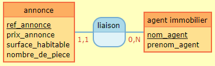

# Technical Test for 3G IMMO

For this technical test, i need to build a CRUD for a property website.

It's a very hard challenge for me, because the constraint is to use Laravel, and **I never use a Framework of PHP**, just PHP Vanilla. So I have one week for learn and create this website.

This test need to have : 
- List of all estate ad with some information (reference, price, living space, number of piece, agent who have this ad)
- Creation of an estate ad
- Modification of an estate ad
- Deletion of an estate ad

I need to use : 
- Laravel 8 for back-end
- All I want for front-end

And, as a bonus, I can add a filter by price and/or living space.

So, let's do it ! 

# Resources and tools I used :
- GitHub for storage online my code and versionning
- Gitmind for build a visual view of User Story, Route and Data Base
- [Laragon](https://laragon.org/), for a configuration of my environment to Laravel
- YouTube for learn Laravel with video _(I used [this playlist](https://www.youtube.com/playlist?list=PLeeuvNW2FHVj4vHJRj9UDeDsXshHlnHJk) from [Nord Coders](https://www.youtube.com/c/NordCoders))_
- The official documentation of [Laravel](https://laragon.org/docs/)
- [Mocodo](http://www.mocodo.net/) for have an "official" visual of my data base

# The different stages of creation :
First, I receive the technical test the 23/08/2022, at, approximatly, 4pm.  
If I say that, it's because I will write here what I did every day.  
And second information : I was in training from 9 a.m. to 5 p.m. on weekdays, and with a part-time job _(21 hours a week)_ in the evenings _(usually from 6 p.m. to 11 p.m.)_ and weekends. So I did this project on my remaining time, as well as on a few hours of training _(I know, it's not good, but shh ;) )_. This information is just for say I don't work on this project 8 hours a day.  

So, let's go ! ;)

### 23/08/2022 : Start to get some videos and documentation of Laravel
I found [this playlist](https://www.youtube.com/playlist?list=PLeeuvNW2FHVj4vHJRj9UDeDsXshHlnHJk) and start to watch this, the 2 first episod. 
I install Laragon for pre-built my environment. 
I'm on Windows for know.  
I just test the system of view and route for print an "Hello World" first.  

### 24/08/2022 : Start to write data base
This day, I start to write with my word and with GitMind the data base, the route and the user story.   
For the data base, it was _easy_ because there are only two table, the estate ad and the estate agent.  
There are two relation :
- one-to-one from estate ad to estate agent
- zero-to-many from estate agent to estate ad

So, it gives that _(one in english for you, and one une french because the project is for the french job)_ : 

But I need to join the 2 tables with a foreign key, because just one agent is on the estate ad, but an agent can have a lot of estate ad. So I decide to contact my recruiter for have the approbation for create an over field on the table.

### 25/08/2022
So, this day, I had the answer of my recruiter : the fields he gave me are the necesary fields, and I can add more field, like ID, foreign key and over.  
So, I decide to add others fields, like ID for estate agent, and "ID_agent" for the estate ad.  
I know we can add more, like "create by/at", or "modify by/at", and over, but I focus on the main objectif, just the CRUD, without login or sign in, because I have no time for this now.  
But, I can add this in the roadmap for the application, and talk to this with the recruiter for proof I think about it.  
And if I have the time, I add some features, like more esthetic, or the other fielsd in the database ;)

But I have one little problem : I don't know how, but phpMyAdmin tell me a lot of error with "depreciad syntax" and other. So, I decide to ignore all, but I want to build correctly my database, so I decide to write SQL, it takes me a more time, but I decide this for don't waste a lot of time I have for build the project.

It's continue to have problem ! It's the job, always a problem and search for a solution X)  
This time, it's to make my foreign key, but I follow my know and the document for this.  
But it's time to go to bed, I think I can fix it tomorrow, with a good night :)

Oh, and I have 2 more day for do the project, becaue there is a big problem with network on my region, so this day, I just have internet 2 hours this afternoon, and after 8 p.m. So I can't learn and fix all my problems. It's life ;) I am not discouraged and will redouble my efforts in the next few days to catch up.
